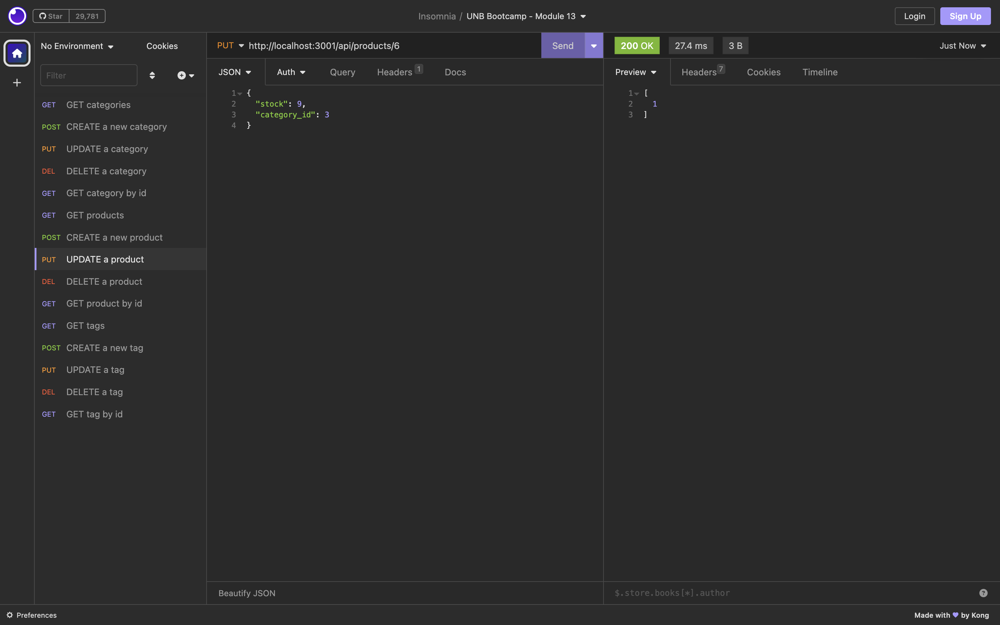

# E-Commerce Website - Back-End

## Description

This application is the back-end of an e-commerce website. It connects to a MySQL database using the `mysql2` and `sequelize` packages based on the database name, MySQL username, and MySQL password provided in the `.env` file. The database can be seeded using the files in the "seeds" folder or by the user.

The api routes in the back-end application allow the user to get all categories, products, or tags, get a category, product, or tag by id, create a new category, product, or tag, update a category, product, or tag, and delete a category, product, or tag.

During this project, I learned more about api routes using `express.js` and how to properly set them up. As well, I became more familiar with using the `sequelize` package to connect to MySQL, establishing tables/models and seeding them.

## Table of Contents

- [Installation](#installation)
- [Usage](#usage)
- [Credits](#credits)
- [License](#license)

## Installation

To install this application, follow these steps:

1. Download the files in the GitHub repo: https://github.com/stms15/eCommerce-website-back-end
2. Create a `.env` file with your own MySQL username, password, and database name
3. Run `npm i` or `npm install` in the terminal to install all of the required packages

## Usage

To use the application, you have to first setup the schema and seeds. I use MySQLWorkbench to set up databases and schema. In MySQLWorkbench, you can run the `schema.sql` file in the "db" folder to initiate the database. If you wish to use the example seeds data provided, you can then run `npm run seed` to populate the database with the tables and data in the "models" and "seeds" folders.

Then you can start the server to use the API by running `npm run start`. The server is set to run locally. Make sure you note the port/server being used for your API calls.

Now you can use the API - I do this using Insomnia. You can perform GET, POST, PUT, and DELETE requests for categories, products, and tags. For each model, you can find all entries, find one by id, create a new one, update an existing entry, or delete one by id. Examples of each request are shown below for the Product model.

**GET all**

**GET one by id**

**POST a new product**

**PUT updated product info**

**DELETE a product by id**

Note that the GET and DELETE requests don't accept a body, but the POST and PUT requests do. For PUT requests (updating an object), you need to have the id of the oject you'd like to update in the request url (".../products/2" to update the second product), and the key-value pair(s) of the field(s) you'd like to update in the body in JSON format.

`{
    "stock": 9,
    "category_id": 3
}`

POST requests require the key-value pairs for all fields associated to that type of object and, for tags and products, any tag/product ids to associate to that object.

Category:
`{
    "category_name": ___
}`

Product:
`{
    "product_name": ___,
    "price": ___,
    "stock": ___,
    "category_id": ____,
    "tagIds": [__, __, ...]
}`

Tag:
`{
    "tag_name": ___,
    "productIds": [__, __, ...]
}`

A complete detailed video on how to use this application can be found here: https://drive.google.com/file/d/1SKds8pd3_nWghGy4Inq81GxSSbVZmsPy/view?usp=sharing

## Credits

The starter code for this application was provided by UNB Coding Bootcamp.

## License

For more information about this license, please see the `LICENSE` file or visit https://spdx.org/licenses/MIT.html.

---

## Badges

